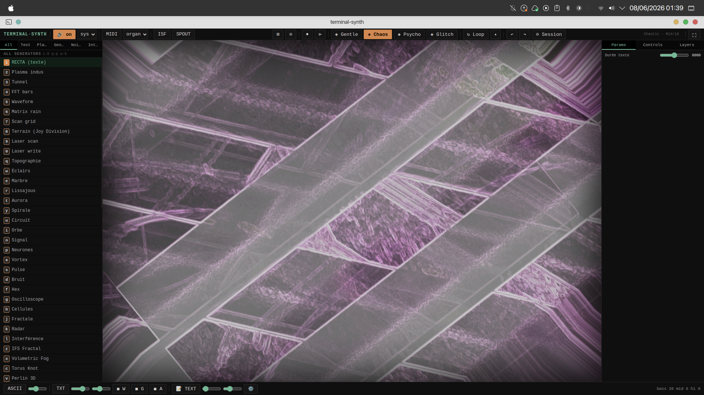
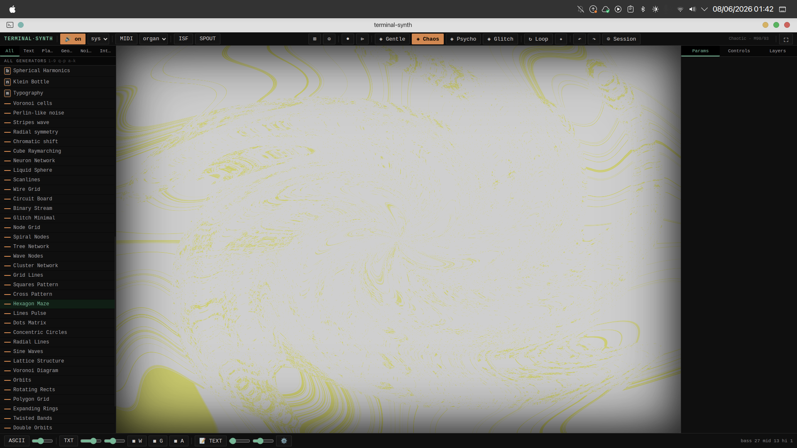
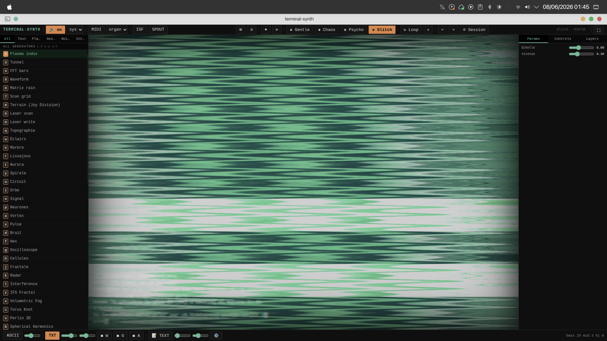
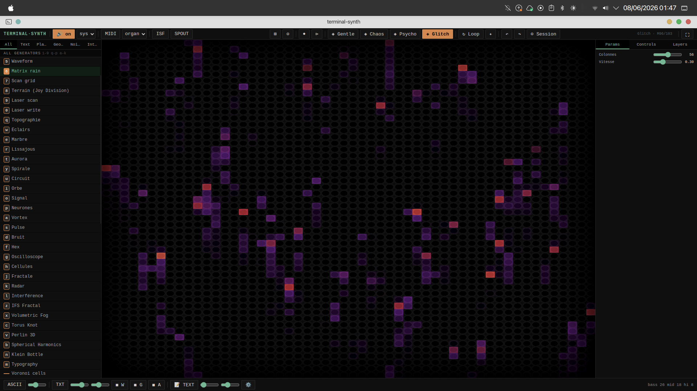

# Terminal-Synth

> **Synthétiseur visuel dark/industriel** avec génération automatique de compositions, audio-réactivité temps réel, et rendu WebGL2 haute-performance.


Terminal-Synth est un visualiseur audio conçu pour les performances visuelles en temps réel. Intègre **~90 générateurs minimalistes**, **23 perturbateurs audio-réactifs**, **séquenceur Ableton Live-style** avec keyframe automation, **MIDI Learn** pour mappages CC, **Master Brightness** audio-réactif, automation générative avec 4 presets, couche texte pixellisée, et système d'enregistrement vidéo.

Bras visuel de **ROBOTARIIS** — univers SF d'Olivier (ex-ROBOTANS).

---

## 🚀 Quick Start

### Linux (Debian/Ubuntu)
```bash
# Download and install .deb package
sudo dpkg -i terminal-synth_1.5.0_amd64.deb
terminal-synth
```

### Windows (Executable)
1. Download `terminal-synth_1.5.0.exe` from [Releases](https://github.com/obareau/terminal-synth/releases)
2. Run directly (no installation needed)
3. Grant audio access when prompted

### macOS / Build from Source
```bash
git clone https://github.com/obareau/terminal-synth.git
cd terminal-synth
npm install
npm start              # Dev mode with hot-reload
npm run package:mac    # Build for macOS
npm run package:linux  # Build .deb for Linux
npm run package        # Build Windows .exe
```

**Requirements**: Node.js 18+, npm 8+

---

## 🎬 Screenshots

### Série Géométrique Minimaliste

**Générateur:** Geometric Shape Series — Patterns élégants en monochrome

### Système Orbital (Spiral Orbits)

**Générateur:** Spiral Orbits — Système dynamique avec animation fluide

### Scanlines CRT Rétro

**Générateur:** Wire Grid / Scanlines — Esthétique rétro et industrielle

### Grille Animée Audio-Réactive

**Générateur:** Grid Nodes — Réagit à l'audio en direct

---

## ✨ Caractéristiques

### 🎨 Rendu Visuel
| Feature | Details |
|---------|---------|
| **~90 Générateurs** | Réseaux de nœuds, systèmes orbitaux, géométrie minimaliste, fractals, noise |
| **6 Catégories** | All, Text, Plasma, Geometry, Noise, Interactive |
| **23 Perturbateurs** | Audio-triggered effects (ripple, twist, glitch, zoom, aberration, etc.) |
| **Esthétique** | Minimaliste Domestika, monochrome noir/blanc, design épuré |
| **WebGL2 Pipeline** | Multi-pass ping-pong avec framebuffers |
| **Modes de Fusion** | 11 blend modes (Normal, Add, Screen, Overlay, etc.) |

### 🎵 Audio & MIDI
| Feature | Details |
|---------|---------|
| **FFT Analysis** | Bass, Mid, Treble, Level en temps réel |
| **BPM Sync** | Timing mesuré (mesures = 4 beats) |
| **Audio Reactive** | Effets + perturbateurs déclenchés par l'audio |
| **MIDI Input** | Clavier MIDI + contrôleurs |
| **System Audio** | Loopback + microphone |

### 💡 Master Brightness (v1.2)
| Feature | Details |
|---------|---------|
| **Audio-Reactive** | Fade to black avec le volume (quasi-noir au silence) |
| **Smooth Fading** | Transitions graduelles via exponential moving average |
| **Slider Control** | Amplitude ajustable (100% → 200% brightness at peak) |
| **Power Curve** | Exponential mapping pour effet dramatique aux bas niveaux |
| **Keyboard Shortcut** | **B** key pour toggle |
| **Perfect For** | Fade-in/fade-out musicaux, transitions début/fin morceaux |

### 🎛️ Sequencer & MIDI Learn (v1.0.1)
| Feature | Details |
|---------|---------|
| **Sequencer** | 16-step BPM-synced automation grid (Ableton Live-style) |
| **Keyframes** | Add/edit with full easing (linear, ease-in, ease-out, ease-in-out) |
| **Operations** | Copy, Paste, Randomize, Record (MIDI CC capture) |
| **Waveform** | Real-time curve visualization with keyframe dots |
| **MIDI Learn** | Ableton-style learn mode: click parameter → move MIDI controller |
| **CC Mapping** | Unlimited CC-to-parameter mappings with curve types (linear, log, exp) |
| **Automation Targets** | 10 parameters: Shader (4), Effects (3), Disruptors (2), Layer B opacity |
| **Shortcuts** | Shift+Q (toggle), Shift+Space (play/stop), C (copy), V (paste), Shift+R (random), Shift+L (learn) |
| **Animations** | Pulsing feedback for MIDI learn & record modes, current step highlighting |
| **Presets** | Sequencer state + MIDI mappings saved/loaded with presets |

### 🏔️ Nightcall Mountains (v1.5.0) ⭐
| Feature | Details |
|---------|---------|
| **Landscape** | 32 hexagonal pyramidal mountains in procedural valley |
| **Rendering** | Hidden-face culling with 3D perspective projection |
| **Details** | Contour rings (adaptive LOD for distant mountains) |
| **Animation** | Forward-scrolling motion with wrapping depth cycle |
| **Sky** | Gradient (violet → yellow) with animated sun halo |
| **Floor Grid** | Cyan wireframe rotated 20°, fast scroll effect |
| **Visual Style** | Synthwave: magenta mountains, blue/cyan grid, black background |

### 🌈 Light/Dark Theme Toggle (v1.5.0)
| Feature | Details |
|---------|---------|
| **Toggle** | Press `T` key or click ☀ button in topbar |
| **Dark Mode** | Original dark theme: #1a1a1a bg, neon green/cyan accents |
| **Light Mode** | Inverted palette: #f5f3ef bg, dark text, readable UI |
| **Persistence** | Theme preference saved to localStorage, restored on restart |
| **Smooth Transitions** | CSS filter-based, instant switching |

### 🌀 Automation Générative (v0.9.5)
| Preset | Behavior |
|--------|----------|
| **Gentle** | 16-32 mesures, changements lents, smooth |
| **Chaotic** | 4-12 mesures, rapide, agressif |
| **Psycho** | 2-8 mesures, ultra-rapide, chaos |
| **Glitch** | 8-16 mesures, focus effets/perturbateurs |

**Génération Avancée**:
- Boucles génératives avec mutation + drift
- Snapshots & historique (50 états max)
- Undo/Redo complet
- Export/Import sessions JSON

### 📝 Couche Texte Pixellisée
- Police géante configurable (10-200%)
- Liste de mots aléatoire
- Pixellisation 1-64px
- Réactif aux effets (CSS filters)
- Audio-réactif (position + wobble)
- Apparition/disparition aléatoire (2-3 boucles)

### 🎮 Interface
| Element | Shortcut | Details |
|---------|----------|---------|
| **Mode ASCII** | `X` | Rendu texte haute-densité avec glitch |
| **Plein Écran** | `F` | Immersif |
| **Audio Toggle** | `A` | On/off |
| **MIDI Toggle** | `M` | On/off |
| **Autoplay** | `Ctrl+A` | 4 presets (toggleable) |
| **Record** | `Ctrl+R` | WebM video |
| **Undo/Redo** | `Ctrl+Z/Y` | Snapshots |
| **Sequencer Toggle** | `Shift+Q` | Enable/disable sequencer |
| **Sequencer Play/Stop** | `Shift+Space` | Play or stop automation |
| **Copy Keyframes** | `C` | Copy selected keyframes |
| **Paste Keyframes** | `V` | Paste keyframes |
| **Randomize** | `Shift+R` | Randomize keyframe values |
| **MIDI Learn** | `Shift+L` | Enter MIDI learn mode |
| **Master Brightness** | `B` | Audio-reactive fade to black |
| **Theme Toggle** | `T` | Switch light/dark theme (persistent) |

**Sélection Générateur**: `1-9`, `q-p`, `a-k` (91 total)

---

## 🎮 Utilisation

### Mode Dev
```bash
npm start              # Electron + esbuild watch
npm run dev            # Alias
npm run test:watch     # Tests live
```

### Build Production
```bash
npm run package        # Windows portable .exe
npm run package:mac    # macOS
npm run package:linux  # Linux
```

### Enregistrement Vidéo
1. Click **⏺** (record button) ou `Ctrl+R`
2. L'enregistrement démarre
3. Re-click ou `Ctrl+R` pour arrêter
4. Sauvegarde `.webm` dans répertoire dialog

### Sequencer (Automation)
1. **Activer**: `Shift+Q` pour toggler le séquenceur
2. **Ajouter des keyframes**: 
   - Clic droit sur une étape (grid 16 steps) → ajoute un keyframe
   - Clic gauche sur une étape existante → ouvre l'éditeur
3. **Éditer des valeurs**:
   - Slider 0-1 pour la valeur
   - Select pour l'easing (linear, ease-in, ease-out, ease-in-out)
4. **Opérations**:
   - `C` = Copy keyframes
   - `V` = Paste keyframes
   - `Shift+R` = Randomize values
5. **Jouer**: `Shift+Space` pour play/stop
6. **MIDI Learn** (optionnel):
   - `Shift+L` = Enter learn mode
   - Bouge un contrôleur MIDI → mapped à un parameter

### MIDI Learn
1. Click `Shift+L` ou le bouton "🎹 Learn"
2. Le bouton pulse (feedback visuel)
3. Bouge un contrôleur MIDI (CC)
4. Mapping créé automatiquement
5. Contrôle le parameter associé en temps réel

### Master Brightness
1. **Toggle**: Press `B` key or click 💡 Master button (bottom bar)
2. **Adjust Intensity**: Drag slider (0 = normal, 1 = +100% amplification)
3. **How It Works**:
   - At silence: Image fades to quasi-black (1% brightness)
   - As volume rises: Image progressively reveals (smooth fade-in)
   - At peak: 100-200% brightness depending on slider
4. **Perfect For**: Music fade-in/fade-out transitions at song start/end
5. **Smooth Transitions**: Exponential moving average prevents abrupt changes

### Export Sessions & Presets
```
Ctrl+A     → Start autoplay (presets, toggleable)
Ctrl+S     → Save preset JSON (inclut sequencer + MIDI mappings)
Ctrl+O     → Load preset JSON
Ctrl+Z/Y   → Undo/Redo snapshots
```

---

## 🏗️ Architecture

### Stack
```
Electron 34
├── TypeScript 5.7
├── WebGL2 (GLSL ES 3.00)
├── Web Audio API (FFT)
└── esbuild + electron-builder
```

### Fichiers Clés
```
src/renderer/
├── gl.ts              ✓ Pipeline WebGL (multi-pass, effects chain)
├── shaders.ts         ✓ 91 générateurs GLSL ES 3.00 + audio reactivity
├── effects.ts         ✓ 31 effets post-process
├── disruptors.ts      ✓ 23 perturbateurs audio-réactifs
├── sequencer.ts       ✓ Ableton Live-style automation (16-step grid, easing, record)
├── midiLearn.ts       ✓ MIDI Learn system (CC mapping, normalization, curves)
├── autoplayAdvanced.ts ✓ Génération automatique + 4 presets
├── textLayer.ts       ✓ Couche texte pixellisée
├── audio.ts           ✓ FFT + audio input
├── ascii.ts           ✓ ASCII glitch multicolore
├── midi.ts            ✓ MIDI input handler
└── renderer.ts        ✓ Event loop + UI glue + Master Brightness + frame loop
```

### Générateurs (91)
**Wireframe & Orbital**: Dark Matter Flow, Orbital Trail, Spiral Orbits, Ring Lattice, Node Tentacles, ...  
**Géométrie**: Cercle, Carré, Triangle, Hexagone, Penrose, Lissajous, Rose, Dragon  
**Fractals**: Mandelbrot, Julia, Sierpinski, Hilbert  
**Noise**: Perlin, Simplex, Worley, Voronoi  
**Patterns**: Grid Lines, Squares, Cross, Hexagon Maze, Wave Nodes, Cluster Network  
**Organics**: Butterfly, Attractor, Pendule, Vortex, Tourbillon  
**Autres**: Kaleidoscope, Halftone, Grid, Wave, Spiral

Tous les générateurs incluent:
- 2 paramètres interactifs (u_p0, u_p1)
- Audio réactivité (bass, mid, treble, level modulation)

### Effets (31)
**Feedback**: Entropie, Feedback, Slit Scan, Glitch  
**Distortion**: Fisheye, Onde, Datamosh, Glitch Rows  
**Color**: Invert, Hue, Thermal, Neon, Posterize Dither  
**Dither**: Floyd-Steinberg dithering  
**Rotation**: Continuous Rotate CW/CCW, Rotate  
**Textures**: Grain, Scanlines, Glow Edges, Kuwahara  
**Flip**: Flip Horizontal/Vertical (miroir X/Y)  
**Autres**: Pixelate, Wave Spiral, Scanlines Distort

### Perturbateurs (23)
**Audio Triggers**: Déchirure, Dropout, Strobe, Corrupt, Tremor, Ripple, Zoom  
**Visual**: Phosphore, Flicker, Shatter, Bloom Burst, Glitch Rows, Twist  
**Glitch**: Flip Horizontal/Vertical, Mosaic Burst, Glitch Block  
**Advanced**: Spin Vortex, Psycho Shift, Displacement Storm, Aberration, Feedback Shatter, Bloom Ring

---

## 🧪 Tests

```bash
npm test              # Run 36 tests once
npm run test:watch    # Watch mode
```

**Coverage**: Générateurs, effets, perturbateurs, audio, BPM sync

---

## 📺 Rendu ASCII

**Mode ASCII** (`X`):
- Caractères variés avec incrustation semi-transparente
- Glitch multicolore subtil (~2% des chars)
- Opacité réduite pour discrétion
- Centré et dynamique

---

## 🎬 Export Video

### WebM (Recommandé)
- ✓ Natif Electron
- ✓ Codec VP8
- ✓ Haute qualité
- ✓ Petite taille
- Sauvegarde directe dans dialog

---

## 🌌 Univers ROBOTARIIS

Terminal-Synth est le **bras visuel** de ROBOTARIIS — univers SF d'Olivier.

| Concept | Description |
|---------|-------------|
| **Calendrier de la Rectitude** | Timing cosmique + structures éphémériques |
| **AZA Sessions** | Sessions longues auto-générative |
| **Factions** | Couleurs + personnalités (Vortex, Flux, Écho, etc.) |
| **Langue de Combat** | Palette sonore + glyphes éphémériques |

Générateurs, effets, perturbateurs = **tactiques Recta** (combat visuel).

---

## 📋 Licence

**MIT** — Libre pour usage créatif & commercial.

---

## 👨‍💻 Crédits

**Développeur**: Olivier Bareau

**Tech Stack**:
- Electron 34 + TypeScript 5.7
- WebGL2 + GLSL ES 3.00
- Web Audio API (FFT)
- esbuild + electron-builder
- Jest + ts-jest (testing)

**Inspirations**: VS (Visual Synthesizer) par Imaginando

---

**v1.2.0** · WebGL2 · 91 Generators · 31 Effects · Sequencer · MIDI Learn · Master Brightness · Generative Automation  
*The ultimate dark industrial visual synthesizer with Ableton Live-style automation and audio-reactive fade-to-black*
