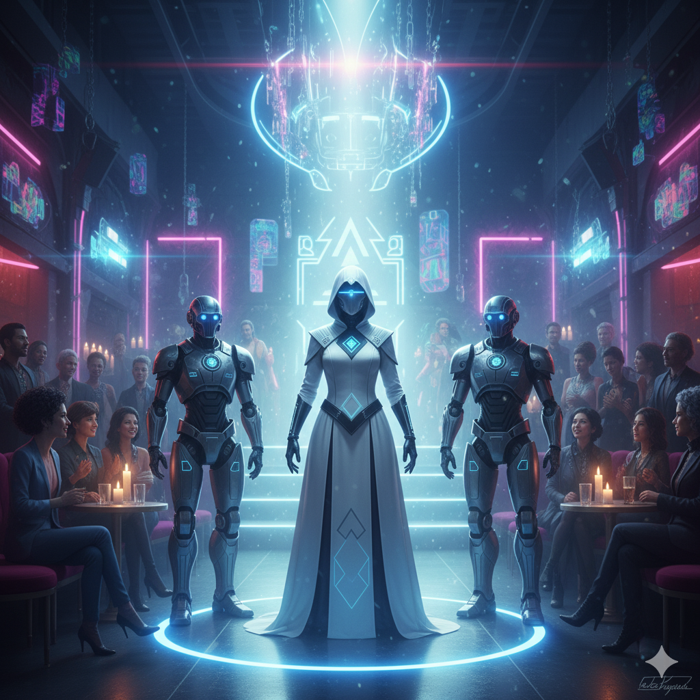

# Terminal-Synth

> **Synthétiseur visuel dark/industriel** — outil de performance live solo, piloté par Adaptive Autoplay, rendu WebGL2 audio-réactif.


Terminal-Synth est un visualiseur audio pensé pour un **performeur solo** : pas de séquenceur pas-à-pas — l'**Adaptive Autoplay** pilote le show en réagissant à la musique (BPM, énergie, onsets), le performeur supervise/influence en direct, et peut aussi piloter n'importe quel paramètre en MIDI Learn (CC, pad ou pitch bend), avec des presets un clic pour nanoKONTROL2, Launchkey Mini MK3 et Launchpad Pro MK3.

Intègre **137 générateurs** (dont 20 Industrial monochrome, 14 Lofi/Chiptune, 3 Media), **57 effets post-process**, **61 perturbateurs audio-réactifs**, **Industrial Mode** (post-process N&B + dither, 4 palettes : B&W / Phosphor / Blueprint / Sepia), **détection BPM** (spectral flux + autocorrélation), **effets beat-réactifs** (pulse, glitch et disruptors synchronisés au tempo), **Adaptive Autoplay** (3 cycles indépendants — générateurs, effets, principal — avec transitions fade), **Master Brightness** audio-réactif, **cap de stages** réglable en live, **Auto-Perf** (dégradation graduée des perfs), couche texte pixellisée adaptive-width, mode ASCII, et export vidéo WebM.

Bras visuel de **ROBOTARIIS** — univers SF d'Olivier (ex-ROBOTANS).

---



---

## 🚀 Quick Start

### Linux (Debian/Ubuntu)
```bash
# Download and install .deb package
sudo dpkg -i terminal-synth_2.1.0_amd64.deb
terminal-synth
```

### Windows (Executable)
1. Download `terminal-synth_2.1.0.exe` from [Releases](https://github.com/obareau/terminal-synth/releases)
2. Run directly (no installation needed)
3. Grant audio access when prompted

### macOS / Build from Source
```bash
git clone https://github.com/obareau/terminal-synth.git
cd terminal-synth
npm install
npm start              # Dev mode with hot-reload
npm run package:mac    # Build for macOS
npm run package:deb    # Build .deb for Linux
npm run package        # Build Windows .exe
```

**Requirements**: Node.js 18+, npm 8+

---

## ✨ Caractéristiques

### 🎨 Rendu Visuel
| Feature | Details |
|---------|---------|
| **137 Générateurs** | Géométrie, plasma, noise, fractals, organics, Industrial, Lofi/Chiptune, Media |
| **57 Effets** | Post-process audio-réactif (feedback, glitch, distortion, color, dither, CRT, kaleidoscope...) |
| **Effect Sequencer** | Syntaxe DNA BPM-synced : `FDB*4, GLT?50, VHS*2+ABR, <NEO*4 ZOM*4>` |
| **61 Perturbateurs** | Glitches déclenchés par l'audio (dropout, strobe, shatter, pixel rain, acid wash, signal cut...) |
| **WebGL2 Pipeline** | Multi-pass ping-pong avec framebuffers |
| **Modes de Fusion** | Blend modes (Normal, Add, Screen, Overlay, etc.) |
| **Layer B** | Second générateur superposable avec opacité réglable |
| **Stage Cap** | Limite le nombre de stages actifs en simultané (réglable en live) |

### ⬛ Industrial Mode (v1.7)
| Feature | Details |
|---------|---------|
| **20 Générateurs Industrial** | Monochrome, esthétique brute/glitch |
| **Post-Process N&B** | Dither IGN (Interleaved Gradient Noise) |
| **4 Palettes** | B&W / Phosphor / Blueprint / Sepia (cycle via bouton) |
| **12 Disruptors Industrial** | Perturbateurs glitch dédiés |
| **HUD Badge** | Affiche le mode + palette active |
| **Autoplay Restriction** | "Industrial Only" force l'autoplay à puiser dans ce pool |

### 🎼 Adaptive Autoplay & Music Analysis (v1.6 / v1.9 / v2.0)
| Feature | Details |
|---------|---------|
| **3 cycles indépendants** | Generator (2–4 mesures), Effets+Disruptors (1–2 mesures), Principal (blend/filtre/sliders) |
| **Fade transitions** | Effets et disruptors : fade-in (amount 0→cible) et fade-out (amount→0 puis off) |
| **Music-Reactive Evolution** | Générateurs/effets/perturbateurs changent en sync avec la musique |
| **BPM Detection** | Spectral flux (256 bins FFT) + autocorrélation 5s + interpolation parabolique + correction d'octave |
| **Beat-Reactive Effects** | `u_beat` (sawtooth) + `u_beatEnv` (envelope) dans COMMON_UNIFORMS — disponibles dans tous les shaders et effets |
| **Energy Display** | Indicateur temps réel (0-100%) color-coded (vert/jaune/rouge) |
| **Style Classification** | Détecte calm/driving/chaotic/peak |
| **Tap Tempo** | `Shift+T` pour caler le tempo manuellement |
| **5 Presets** | Gentle / Chaotic / Psycho / Glitch / Minimal — vitesse et intensité des évolutions |
| **Snapshots & Historique** | Undo/Redo (50 états max), export/import sessions JSON |

### ⚡ Auto-Perf (v1.7.4)
| Feature | Details |
|---------|---------|
| **Dégradation Graduée** | L1 réduit le stage cap, L2/L3 réduisent le render scale |
| **Seuils** | Engage si FPS < 50 pendant 5s, récupère si FPS ≥ 58 pendant 10s |
| **Affichage** | Niveau visible dans le meter de performance |

### 🎵 Audio & MIDI
| Feature | Details |
|---------|---------|
| **FFT Analysis** | Bass, Mid, Treble, Level en temps réel |
| **System Audio** | Loopback (monitor) ou microphone — bouton ⚙ pour choisir le périphérique exact |
| **Linux/PipeWire** | Détection automatique (monitor/loopback/moniteur) + picker manuel si ambiguïté |
| **MIDI Input** | Notes → énergie (mode organ/noise), mod wheel, pitch bend |
| **MIDI Learn** (v1.9.4, notes v2.1.0) | CC, pad (note) ou pitch bend → n'importe quel paramètre (effets, disruptors, scènes, brightness, stage cap...). Clic droit = débind |
| **Presets hardware** (v2.1.0) | Un clic : **KORG** (nanoKONTROL2), **LKEY** (Launchkey Mini MK3), **LPAD** (Launchpad Pro MK3 — grille 8×8, 58/61 disruptors) |
| **Feedback LED** (v2.1.0) | Pads mappés par note s'allument selon l'état actif (scène = bleu, disruptor = rouge) — Launchkey/Launchpad |

### 💡 Master Brightness (v1.2)
| Feature | Details |
|---------|---------|
| **Audio-Reactive** | Fade to black avec le volume (quasi-noir au silence) |
| **Smooth Fading** | Transitions graduelles via exponential moving average |
| **Slider Control** | Amplitude ajustable (100% → 200% brightness at peak) |
| **Power Curve** | Mapping exponentiel pour effet dramatique aux bas niveaux |
| **Keyboard Shortcut** | `B` pour toggle |
| **Perfect For** | Fade-in/fade-out musicaux, transitions début/fin morceaux |

### 🌈 Light/Dark Theme Toggle
| Feature | Details |
|---------|---------|
| **Toggle** | Press `T` (hors focus mode) ou bouton ☀ dans la topbar |
| **Persistence** | Préférence sauvegardée en localStorage |

### 📝 Couche Texte Pixellisée (v2.0)
- **Adaptive width** — la fonte se scale automatiquement pour remplir N% de la largeur canvas (slider 30–100%, défaut 85%)
- **Police aléatoire par mot** — pool cross-platform : DejaVu Sans Mono, Menlo, Consolas, Liberation Mono, Liberation Sans, Helvetica Neue, Georgia + génériques
- **35 mots lexique ROBOTARIIS/Indus** — RECTA, VORTEX, VOID, PROTOCOL, OVERRIDE, WARFARE, FACTION…
- Pixellisation 1-64px, réactif à l'audio (position + wobble)
- Cycle naturel : 2 mots visibles (3s chacun) → 25s de pause

### 🖼 Media Loader (v1.9.10)

Onglet **Media** dans le panel générateurs :
- **📂 Image / Vidéo** — file picker, upload WebGL texture slot 5 (`u_media`)
- **Webcam** — freeze-frame capture toutes les X secondes, texture pixelisée (GL_NEAREST)
- **3 générateurs Media** — `Media Direct` (warp + chroma split), `Media Glitch` (bandes VHS), `Media Kaleid` (kaléidoscope N-faces)
- `mediaCol(uv)` disponible dans tous les shaders GLSL

### 🎛 Effect Sequencer (v1.9.5)

Séquenceur d'effets BPM-synced. Accessible dans le panel gauche → onglet **Controls** → champ **SEQ** au-dessus de la liste d'effets.

**Syntaxe :**
```
FDB*4, GLT?50, VHS*2+ABR, <NEO*4 ZOM*4>, D:STR*2
```
- `ID*N` — effet ON pendant N beats, puis off → step suivant
- `ID?P` — probabilité P% de déclencher le step
- `A+B` — effets simultanés dans le même step
- `<A B C>` — alternance : cycle parmi les options à chaque passage
- `D:ID` — disruptor dans le SEQ
- Entrée ou ▶ pour lancer, ■ pour stopper

**57 effets :**

| ID | Effet | ID | Effet | ID | Effet |
|----|-------|----|-------|----|-------|
| `ENT` | Entropie | `FDB` | Feedback | `GLT` | Glitch |
| `FLT` | Filtre | `INV` | Invert | `GRN` | Grain |
| `NEO` | Neon | `OND` | Onde | `FSH` | Fisheye |
| `HUE` | Hue | `SCN` | Scanlines | `DTM` | Datamosh |
| `PIX` | Pixelate | `THM` | Thermal | `ZOM` | Zoom |
| `VHS` | VHS | `SEU` | Seuil | `ABR` | Aberration |
| `BLM` | Bloom | `MIR` | Miroir | `DTH` | Dithering |
| `CHR` | Chrono | `KUW` | Kuwahara | `SLT` | Slit Scan |
| `GLW` | Glow Edges | `PDT` | Posterize Dither | `FLD` | Floyd-Steinberg |
| `RCW` | Rotate CW | `RCC` | Rotate CCW | `SCD` | Scanlines Distort |
| `WSP` | Wave Spiral | `NTC` | NTSC Chroma | `CPV` | Composite Video |
| `AGH` | Analog Ghosting | `CBL` | Color Bleed | `LUM` | Luma Separation |
| `RFN` | RF Noise | `ORL` | Orbit Ring Lines | `ONC` | Orbit Nodes Connect |
| `OSP` | Orbit Spiral | `POR` | Pulsing Orbits | `NPL` | Network Pulse |
| `ORN` | Orbital Nodes | `WRN` | Wave Rings | `BWR` | BW Orbital Ring |
| `BWG` | BW Grid Lines | `SBW` | Starfield BW | `DUO` | Duotone |
| `PST` | Pixel Sort | `CRT` | CRT Warp | `KAL` | Kaleidoscope |
| `RPB` | Ripple Beat | `SLZ` | Solarize | `GBL` | Glitch Blocks |
| `TRL` | Trails | `CGR` | Color Grade | `ZBL` | Zoom Blur |

**61 disruptors (préfixe `D:` dans le SEQ) :**

| ID | Nom | ID | Nom | ID | Nom |
|----|-----|----|-----|----|-----|
| `DCH` | Déchirure | `DRP` | Dropout | `STR` | Strobe |
| `CRP` | Corrupt | `TRM` | Tremor | `PHS` | Phosphore |
| `FLK` | Flicker | `SHT` | Shatter | `BBR` | Bloom Burst |
| `GRW` | Glitch Rows | `FLH` | Flip H | `FLV` | Flip V |
| `MSB` | Mosaic Burst | `SVX` | Spin Vortex | `PSH` | Psycho Shift |
| `DST` | Displacement Storm | `NGB` | Negative Burst | `RDW` | Radial Warp |
| `CSH` | Color Shift | `ZMP` | Zoom Pulse | `IJT` | Interlace Jitter |
| `MFL` | Mirror Flip | `FRB` | Frequency Bars | `TSH` | Temporal Shift |
| `STB` | Static Burst | `RGX` | RGB Explosion | `HCL` | H-Collapse |
| `TSC` | Tile Scramble | `DBL` | Datableed | `SIG` | Signal Cut |
| `PRN` | Pixel Rain | `ACD` | Acid Wash | `FRZ` | Freeze Glitch |
| `WML` | Wave Melt | `VTR` | Vertical Tear | `ECD` | Echo Drift |
| `HSM` | Heat Shimmer | `NGS` | Negative Spike | `SLB` | Scanline Burn |
| `BLS` | Blink Strip | `CFG` | Chroma Fog | `DGE` | Digital Echo |
| `CLM` | Color Melt | `WRL` | Warp Lens | `PCR` | Pixel Crush |
| `CHB` | Crosshatch Burn | `BWD` | Bandwidth | `NFR` | Neon Flare |
| `SBK` | Static Block | `BLD` | Block Displace *(Indus)* | `SCT` | Scan Tear *(Indus)* |
| `FRH` | Frame Hold *(Indus)* | `DMS` | Datamosh *(Indus)* | `SGL` | Signal Loss *(Indus)* |
| `SYL` | Sync Lost *(Indus)* | `BCR` | Bit Crush *(Indus)* | `GLS` | Glyph Storm *(Indus)* |
| `HTP` | Halftone Pulse *(Indus)* | `SLD` | Scanline Density *(Indus)* | `CSK` | Contour Shock *(Indus)* |
| `NGF` | Negative Flash *(Indus)* | | | | |

### 📺 Mode ASCII
- Rendu texte haute-densité avec glitch multicolore subtil
- Toggle via `X`, easter egg overlay permanent via `Alt+A`

---

## 🎮 Interface & Raccourcis

| Touche | Action |
|--------|--------|
| `1-9`, `q-p`, `a-k` | Sélection générateur |
| `A` | Toggle audio |
| `M` | Toggle MIDI |
| `X` | Toggle mode ASCII |
| `T` | Toggle texte (ou thème light/dark hors focus mode) |
| `B` | Master Brightness (fade-to-black audio-réactif) |
| `F` / `F11` | Plein écran |
| `Tab` | Focus mode (canvas plein écran interne) |
| `Escape` | Quitte performance/focus mode, sort du plein écran |
| `Espace` | Force la tactique suivante (RECTA) |
| `Shift+T` | Tap tempo (BPM) |
| `Shift+P` | Performance mode (HUD plein écran) |
| `Shift+O` | Ouvre une fenêtre de sortie (2e écran) ou performance mode |
| `H` | Toggle HUD (en performance mode) |
| `Ctrl+A` | Toggle Adaptive Autoplay |
| `Ctrl+S` / `Ctrl+O` | Sauvegarder / charger un preset JSON |
| `Ctrl+R` | Démarrer/arrêter l'enregistrement vidéo |
| `Ctrl+Z` / `Ctrl+Y` | Undo / Redo |

---

## 🎬 Enregistrement Vidéo

- Click **⏺** (bouton record) ou `Ctrl+R`
- L'enregistrement démarre, re-click ou `Ctrl+R` pour arrêter
- Export **WebM** (natif, codec VP8)

---

## 🏗️ Architecture

### Stack
```
Electron 34
├── TypeScript 5.7
├── WebGL2 (GLSL ES 3.00)
├── Web Audio API (FFT)
└── esbuild + electron-builder
```

### Fichiers Clés
```
src/
├── main.ts                   Process principal Electron (fenêtres, IPC, export vidéo)
├── preload.ts                 Pont contextBridge ↔ renderer
└── renderer/
    ├── gl.ts                  Pipeline WebGL2 (multi-pass, effects chain, u_media)
    ├── shaders.ts             100 générateurs GLSL ES 3.00 (builtin)
    ├── industrialShaders.ts   20 générateurs Industrial monochrome
    ├── lofiShaders.ts         14 générateurs Lofi/Chiptune/ASCII
    ├── mediaShaders.ts         3 générateurs Media (u_media texture)
    ├── effects.ts             57 effets post-process
    ├── disruptors.ts          61 perturbateurs (24 builtin + 25 nouveaux)
    ├── industrialDisruptors.ts 12 perturbateurs Industrial
    ├── audio.ts               FFT + audio input (loopback/micro)
    ├── musicAnalyzer.ts       BPM / énergie / style / tap tempo
    ├── autoplay.ts            Logique autoplay de base
    ├── autoplayAdapter.ts     Pont autoplay ↔ audio live
    ├── autoplayAdvanced.ts    3 cycles indépendants, fade transitions, 5 presets
    ├── textLayer.ts           Couche texte adaptive-width, font pool cross-platform
    ├── textsource.ts          Source de texte RECTA (tactics, holdMs)
    ├── ascii.ts               Rendu ASCII glitch
    ├── midi.ts                Input MIDI brut + MIDI Learn
    ├── videoExport.ts         Capture/export vidéo WebM
    └── renderer.ts            Event loop + UI glue + frame loop
```

---

## 🧪 Tests

```bash
npm test              # Run test suite
npm run test:watch    # Watch mode
```

**Coverage**: Générateurs, effets, perturbateurs, audio, BPM sync

---

## 🌌 Univers ROBOTARIIS

Terminal-Synth est le **bras visuel** de ROBOTARIIS — univers SF d'Olivier.

| Concept | Description |
|---------|-------------|
| **Calendrier de la Rectitude** | Timing cosmique + structures éphémériques |
| **AZA Sessions** | Sessions longues auto-génératives |
| **Factions** | Couleurs + personnalités (Vortex, Flux, Écho, etc.) |
| **Langue de Combat** | Palette sonore + glyphes éphémériques |

Générateurs, effets, perturbateurs = **tactiques Recta** (combat visuel).

---

## 📋 Licence

**MIT** — Libre pour usage créatif & commercial.

---

## 👨‍💻 Crédits

**Développeur**: Olivier Bareau

**Tech Stack**:
- Electron 34 + TypeScript 5.7
- WebGL2 + GLSL ES 3.00
- Web Audio API (FFT)
- esbuild + electron-builder
- Jest + ts-jest (testing)

**Inspirations**: VS (Visual Synthesizer) par Imaginando

---

**v2.1.0** · WebGL2 · 137 Generators · 57 Effects · 61 Disruptors · Industrial Mode · Adaptive Autoplay · Fade Transitions · Master Brightness · Media Loader · Text Layer · MIDI Learn (CC/note/PB) + presets Launchkey/Launchpad
*Dark industrial visual synthesizer for solo live performance — autoplay-driven, music-reactive.*
